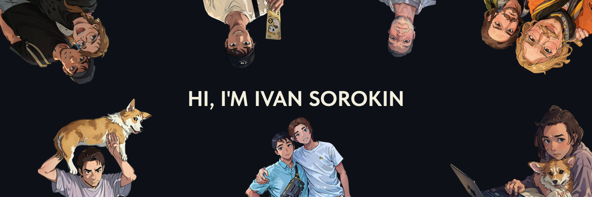

[](https://github.com/TAPAKAHOKOT/TAPAKAHOKOT)

<!-- [](https://tapakahokot.ru/)  -->
[](https://t.me/TAPAKAHOKOT) 
<!-- [](https://vk.com/kpabakot) -->

### Hi there 👋

I'm Ivan, a Python developer, I really love to create and develop my personal projects, my favorites you can see below 👇

<!--Want to know more about me? [Check out my portfolio](https://tapakahokot.ru/). -->

<!--
## 📝 Latest articles
* <a href="https://tproger.ru/articles/lichnyj-opyt-kak-prokachat-navyki-programmirovanija-rabotaja-nad-pet-proektom/">Личный опыт: как прокачать навыки программирования, работая над pet-проектом</a>
-->

## 📽 About my favorite projects
[Recycop](http://recycop.ru)
```
A new (in develop) project to improve the logistics of recycling collection.
It uses django (for back) + vue3 (for front)
(private repo)
```

[Tapakahokot VPN bot](https://t.me/tapakahokot_vpn_bot)
```
Telegram bot to sell VPN (Trojan based on Xray-core).
It uses aiogram3 (for tg bot) + flask (for webapp) + custom tg bot template.
It has 379 commits+ but the project is private, you can check bot only :(
(private repo)
```

<!-- Pinned Repositories -->
<!--
<a href="https://github.com/TAPAKAHOKOT/TgBotTemplate">
  
</a>
<a href="https://github.com/TAPAKAHOKOT/TgRomanticBot">
  
</a>
<a href="https://github.com/TAPAKAHOKOT/BattleCity1980">
  
</a>
<br>
-->

## 📈 GitHub Stats
<!-- GitHub Stats -->
<a href="https://github.com/TAPAKAHOKOT">
  
</a>
<a href="https://github.com/TAPAKAHOKOT">
  
</a>


## 💼 Skills

   


<!--
**TAPAKAHOKOT/TAPAKAHOKOT** is a ✨ _special_ ✨ repository because its `README.md` (this file) appears on your GitHub profile.

Here are some ideas to get you started:

- 🔭 I’m currently working on ...
- 🌱 I’m currently learning ...
- 👯 I’m looking to collaborate on ...
- 🤔 I’m looking for help with ...
- 💬 Ask me about ...
- 📫 How to reach me: ...
- 😄 Pronouns: ...
- ⚡ Fun fact: ...
-->
