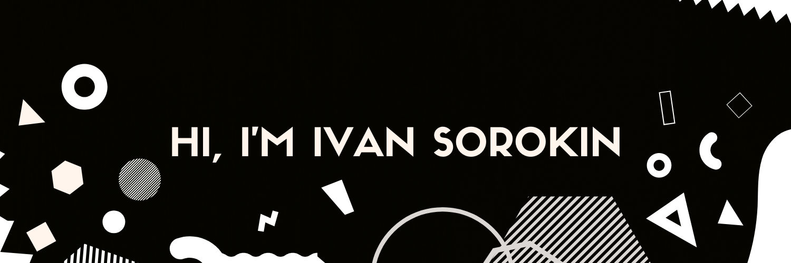

     

### Hi there 👋

I'm Ivan, a PHP developer, I really love to create and develop my personal projects, my favorites you can see below 👇

Want to know more about me? [Check out my portfolio](https://tapakahokot.ru/).

## 📝 Latest articles
* <a href="https://tproger.ru/articles/lichnyj-opyt-kak-prokachat-navyki-programmirovanija-rabotaja-nad-pet-proektom/">Личный опыт: как прокачать навыки программирования, работая над pet-проектом</a>

## 📌 Pinned Repositories
<!-- Pinned Repositories -->

 

 

## 📈 GitHub Stats
<!-- GitHub Stats -->

## 💼 Skills

         

<!--
**TAPAKAHOKOT/TAPAKAHOKOT** is a ✨ _special_ ✨ repository because its `README.md` (this file) appears on your GitHub profile.

Here are some ideas to get you started:

- 🔭 I’m currently working on ...
- 🌱 I’m currently learning ...
- 👯 I’m looking to collaborate on ...
- 🤔 I’m looking for help with ...
- 💬 Ask me about ...
- 📫 How to reach me: ...
- 😄 Pronouns: ...
- ⚡ Fun fact: ...
-->
