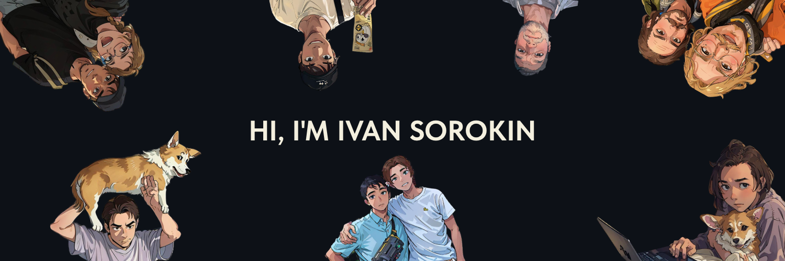

  
  
  

### Hi, I'm Ivan 👋

**Building fun things with AI — from D&D game masters to support systems.**

Backend-leaning full-stack engineer. Python & TypeScript, async services, Postgres, queues, LLM agents — and the infra to keep it all running.

## 🚀 Featured projects

### 🎲 [Dice×Dice](https://dicexdice.io) — AI Game Master for D&D
Play D&D in the browser: an AI runs the game, the stories are written by people.
- AI Game Master agent with tool calling and token-by-token streaming over WebSocket, on an event-sourced game core with branching turns
- **Taleport** — pipeline where coding agents adapt a written story into a playable game and verify it by playing real sessions over MCP
- Started it as a Telegram D&D bot with RAG over the rulebook, dice mechanics and persistent campaigns

`Python` `pydantic-ai` `PostgreSQL` `DBOS` `Redis` `WebSocket` `MCP` `Kubernetes` `OpenTelemetry`

### 🛡 [Tapakahokot VPN](https://t.me/tapakahokot_vpn_bot) — subscription platform, in production since 2022
Everything behind a VPN service run solo for 4 years: 1300+ commits, ~45k lines of async Python.
- Multi-server subscriptions with load-aware placement, sticky hashing and self-healing reconcile jobs
- Health monitor doing real protocol-level probes across the fleet, with a state machine, SSH auto-repair and alerting
- **Support system:** real-time operator desk + 3-tier AI auto-replies (rules → LLM classifier → RAG answer) with operator handoff and race-safe dedup
- Payments with webhooks & auto-renewal, Ansible node provisioning, tag-based CD, ~1300 tests

`aiogram` `FastAPI` `SQLAlchemy 2` `Dramatiq` `Redis` `PostgreSQL` `Xray` `Ansible` `Vue` `Next.js`

### 🃏 [Cards](https://cards-tcg.com) — real-time multiplayer card game
- Deterministic, versioned game engine (seeded RNG, serializable state) + WebSocket match server
- Postgres event log, least-privilege DB roles, row & advisory locks, idempotent room creation
- 300+ test files: property-based tests and integration tests that restart the server mid-match

`TypeScript` `Node.js` `WebSocket` `PostgreSQL` `fast-check` `Playwright`

### 💸 [Moapp](https://github.com/TAPAKAHOKOT/moapp) — shared expense tracker
Passwordless workspaces, offline sync with idempotency & optimistic concurrency, built-in OAuth 2.1 + MCP endpoint for ChatGPT, AES-GCM-encrypted Bybit integration, SQLite continuously replicated to R2 with weekly restore checks.

`Fastify` `SQLite` `Litestream` `OAuth 2.1` `MCP` `React`

<b>More things I've made</b>

- 🧩 [Prompt IDE](https://github.com/TAPAKAHOKOT/promptIDE) — Excalidraw for prompts ([live](https://promptide.tapakahokot.com))
- 🔘 [bnt](https://github.com/TAPAKAHOKOT/bnt) — wearable push-to-talk AI button: ESP32 firmware + FastAPI STT → LLM → TTS
- 🗂 [zen-smart-tabs](https://github.com/TAPAKAHOKOT/zen-smart-tabs) — Zen Browser mod that groups tabs into folders with GPT
- 🏆 [scorer](https://github.com/TAPAKAHOKOT/scorer) — board-game score tracker (Next.js, tRPC, Prisma)

## 🛠 Stack

## 📈 Activity

  

<picture>
  <source media="(prefers-color-scheme: dark)" srcset="https://raw.githubusercontent.com/TAPAKAHOKOT/TAPAKAHOKOT/output/github-snake-dark.svg">
  
</picture>
